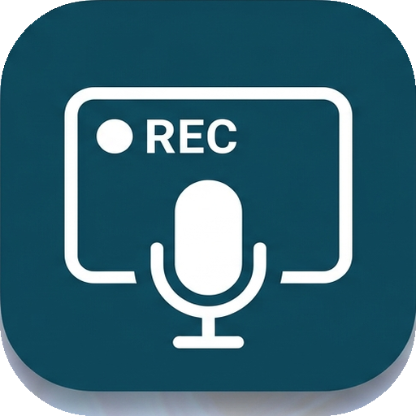

# ScreenClip Recorder



Windows에서 마우스로 고른 영역과 **시스템 출력 소리만** H.264/AAC MP4로 녹화하는 WPF MVP입니다. 마이크는 열지 않습니다.

## 다운로드

GitHub의 **Releases** 페이지에서 최신 `ScreenClipRecorder-win-x64.zip`을 내려받고, 새 폴더에 전체 압축을 해제한 뒤 `ScreenClipRecorder.exe`를 실행하세요. EXE만 따로 옮기면 필요한 네이티브 DLL을 찾지 못할 수 있습니다.

`v1.0.0` 같은 태그를 푸시하면 GitHub Actions가 Windows x64 실행 ZIP과 Release를 자동으로 생성합니다.

## 기능

- 현재 마우스가 있는 모니터에서 드래그 영역 선택 (단일 모니터 내부)
- H.264 하드웨어 인코딩 + AAC 시스템 오디오(WASAPI loopback)
- 30/60 FPS 및 용량 절약/표준/고화질/게임 프리셋
- 최대 1080p/1440p 축소, 예상 파일 크기 표시
- 자동 파일명 `ScreenClip_yyyyMMdd_HHmmss.mp4`
- 시작 지연, 지정 시간 자동 종료, 커서 포함
- 일시정지/재개/중지
- 전역 단축키: `Ctrl+Shift+R`, `Ctrl+Shift+P`, `Ctrl+Shift+S`

## 요구 환경

- Windows 10 2004 이상 또는 Windows 11 (x64)
- [.NET 8 SDK](https://dotnet.microsoft.com/download/dotnet/8.0) 또는 Visual Studio 2022의 **.NET 데스크톱 개발** 워크로드
- Visual C++ 2015–2022 x64 재배포 패키지
- Windows N/KN 에디션은 Media Feature Pack 필요

## 빌드 및 실행

```powershell
dotnet restore .\ScreenClipRecorder.sln
dotnet build .\ScreenClipRecorder.sln -c Release -p:Platform=x64
dotnet run --project .\ScreenClipRecorder\ScreenClipRecorder.csproj -c Release
```

Visual Studio에서는 `ScreenClipRecorder.sln`을 열고 플랫폼을 `x64`로 선택한 뒤 실행합니다.

단일 실행 폴더로 게시:

```powershell
dotnet publish .\ScreenClipRecorder\ScreenClipRecorder.csproj -c Release -r win-x64 --self-contained true -p:PublishSingleFile=true
```

## 사용법

1. **영역 선택**을 누릅니다. 현재 마우스가 있던 모니터가 선택 화면으로 바뀝니다.
2. 드래그한 뒤 `Enter`로 확정합니다. `Esc`는 취소입니다.
3. 화질, 저장 위치, 자동 종료, 시작 지연을 정하고 **녹화 시작**을 누릅니다.

보호된 DRM 영상, UAC 보안 데스크톱, 일부 독점 전체화면 콘텐츠는 Windows 정책상 검게 캡처될 수 있습니다. 영역은 한 모니터 안에 있어야 합니다.

## 구현 및 확장점

`RecordingService`가 UI와 녹화 엔진을 분리합니다. ScreenRecorderLib 6.6.0을 통해 Direct3D/Windows Graphics Capture 계열 캡처, Media Foundation H.264/AAC 인코딩, WASAPI 출력 캡처를 사용합니다.

- **HEVC**: `H264VideoEncoder`를 `H265VideoEncoder`로 바꾸는 고급 프리셋을 추가할 수 있습니다. 장치의 HEVC 인코더와 재생 코덱 유무를 확인해야 합니다.
- **특정 앱 오디오**: Windows 10 2004+ process loopback(`AUDIOCLIENT_ACTIVATION_TYPE_PROCESS_LOOPBACK`) 엔진을 `RecordingService` 뒤에 추가할 수 있습니다.
- **다중 모니터 걸침**: 모니터별 D3D 텍스처를 합성해야 하므로 MVP에서는 제외했습니다.

ScreenRecorderLib은 MIT 라이선스입니다. 배포 시 라이선스 고지를 함께 포함하세요.
